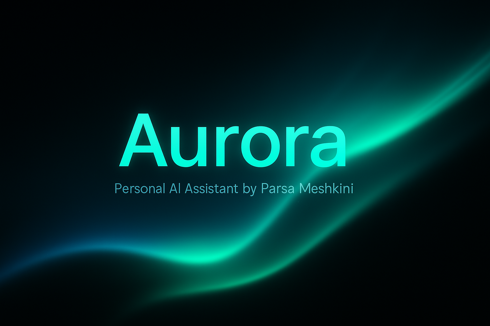

<p align="center">
  
</p>

<h1 align="center">🌌 Aurora — Personal AI Assistant</h1>

<p align="center">
  
</p>

<p align="center">Created by <strong>Parsa Meshkini</strong></p>

<p align="center">
  
  
  
  
</p>

---

## 🚀 Live Demo

### ✅ Frontend (Aurora Chat UI)  
👉 **https://www.chat.parsameshkini.com**

### ✅ Backend API  
👉 **https://aurora-agent-1.onrender.com/api/ask/**

---

## 🧠 What Is Aurora?

Aurora is a custom AI assistant designed to represent  
**Parsa Meshkini** — it answers questions about him, his skills, and his work, while also providing a general conversational interface powered by **Google Gemini 2.5 Flash**.

Aurora includes:
- Custom personality  
- Predefined answers for common Parsa-related questions  
- Live text streaming (ChatGPT-style)  
- Fully styled responsive UI  
- Offline-safe GitHub Actions uptime script  

---

## 🎨 Aurora Logo

<p align="center">
  
</p>

---

## ✨ Features

### 🤖 AI Features
- Google Gemini 2.5 Flash integration  
- Aurora custom identity  
- Answers questions about:
  - Parsa Meshkini  
  - Studies & background  
  - Skills (Python, Django, React, AI)  
  - Portfolio & contact  
- Smart fallback to full AI model  

### 🖥️ Frontend Features
- React modern chat layout  
- Live typing animation (like ChatGPT)  
- Aurora-themed animated background  
- Responsive UI for all devices  
- Message history stays visible  
- Clean UI with glowing effects  

### 🔧 Backend (Django)
- High-performance REST API  
- Clean prompt engineering  
- Custom logic + Gemini fallback  
- CORS-secured  
- Auto-serving on Render  

### 🔄 Keep-Alive Automation
- GitHub Actions runs every 15 minutes  
- Pings:
  - ✅ Backend API  
  - ✅ Frontend site  
- Prevents Render free-tier sleep  


## 📁 Project Structure
```text
aurora-agent/
│
├── backend/
│ ├── aurora_backend/
│ ├── chat/
│ ├── requirements.txt
│ ├── manage.py
│ └── .env (ignored)
│
├── frontend/
│ ├── src/
│ ├── public/
│ ├── package.json
│ └── .env (ignored)
│
└── .github/workflows/
└── keepalive.yml
```

## ▶️ Running Locally

### Backend
cd backend
pip install -r requirements.txt
python manage.py runserver

### Frontenf
cd frontend
npm install
npm start

📬 Contact

Created by Parsa Meshkini

🌐 Website: https://www.parsameshkini.com

📧 Email: pameshkini@gmail.com

🔗 LinkedIn: https://linkedin.com/in/parsameshkini

⭐ Future Upgrades

Full chat history

User accounts

AI voice mode

Parsa project auto-explanations

Aurora personality modes

✅ License

MIT License — feel free to fork and build upon it.
